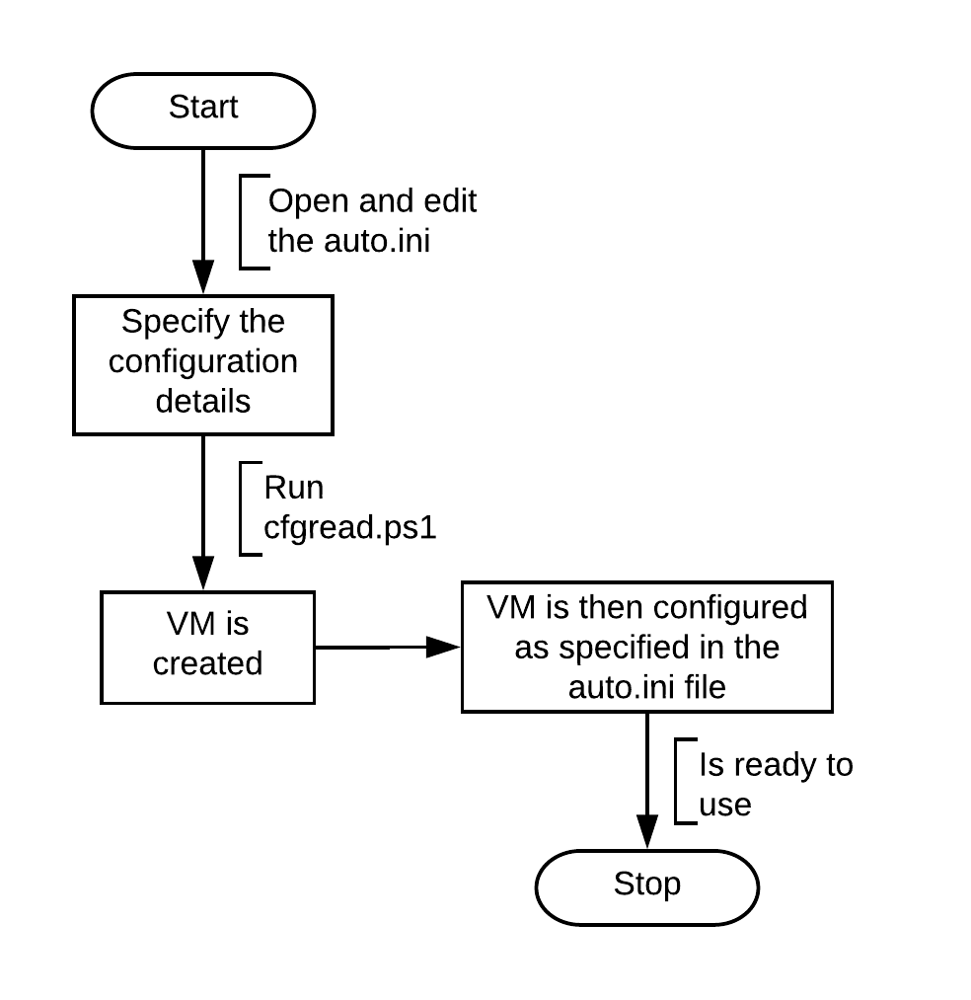

# Context
Here is a simple script to create multiple VMs of different OS versions from existing templates in the vSphere Web CLient. 
It also configures the basic configurations and deploys it.

# Instructions

* Download and Install Windows PowerShell ISE.
* Run in Administrator mode.
* Import the following modules: 
    * Import-Module VMware.VimAutomation.Core 
    * Import-Module VMware.VimAutomation.Vds 
    * Import-Module VMware.VimAutomation.Storage
* Save these scripts locally. 
* Specify the details of the environment to be created in the “auto.ini” file.
* Either open "cfgread.ps1" from File dropdown and click on Run or enter "./cfgread.ps1" from CLI.

# How it works

